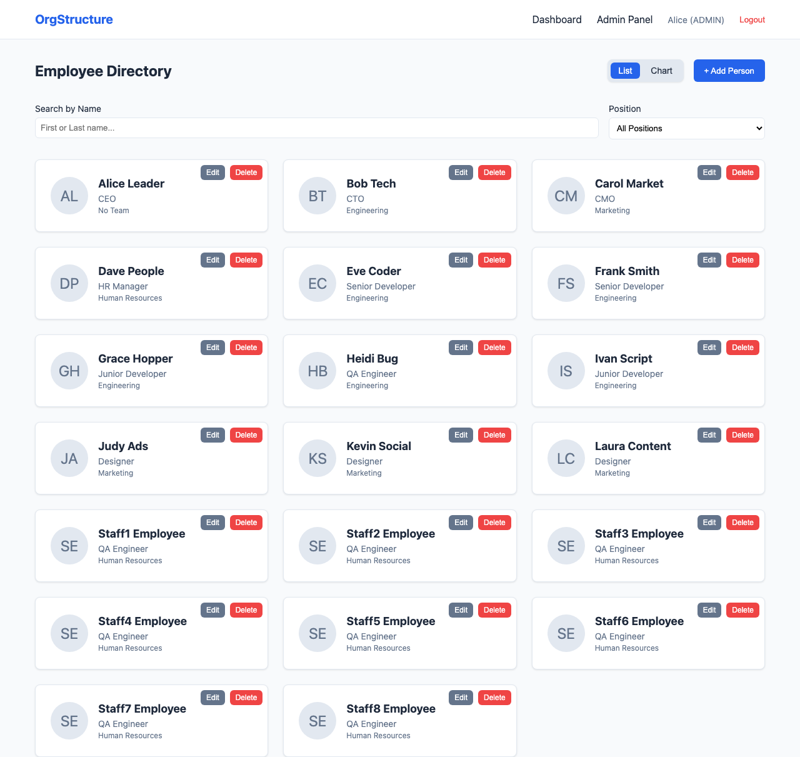
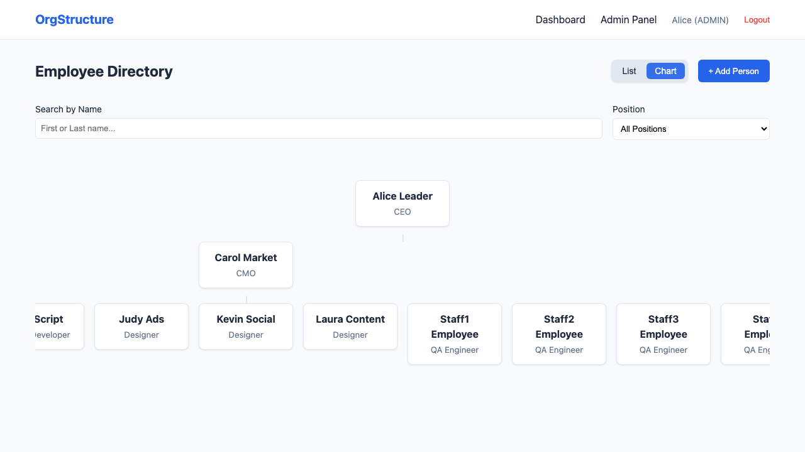
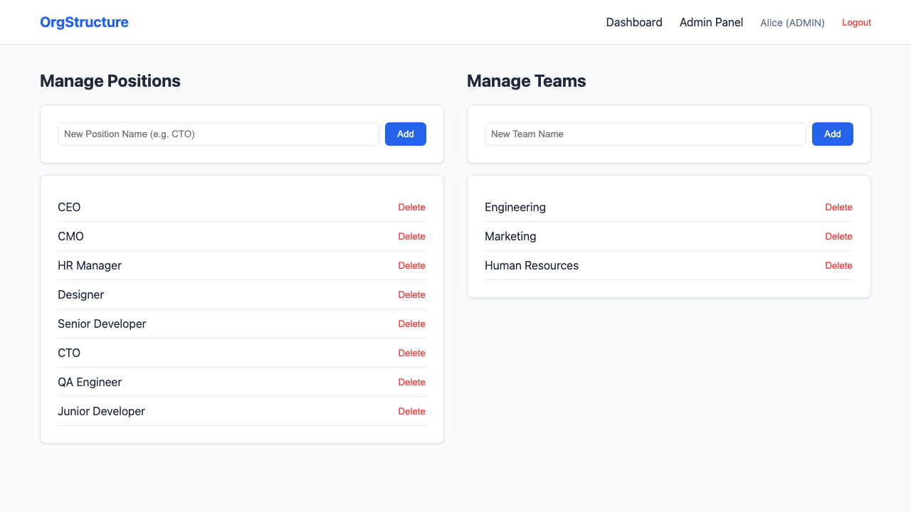
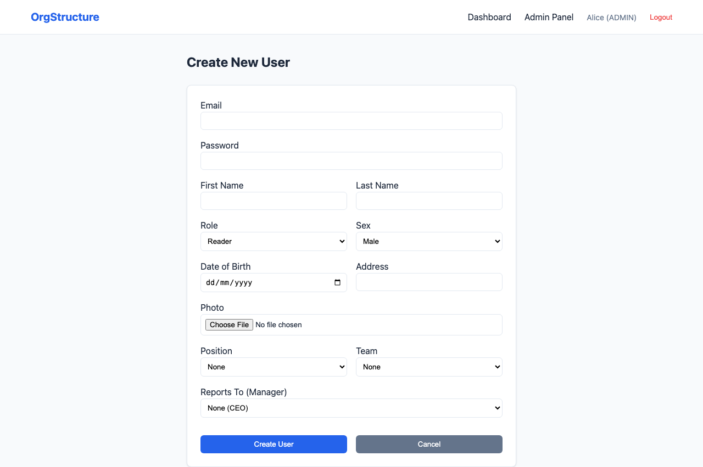

# Organization Structure Management System

[](#)

A full-stack web application to manage and visualize an organization's structure with Role-Based Access Control (RBAC).

## Features

- **RBAC:** Admin, Editor, and Reader roles.
- **Dynamic Organization:** Manage Positions (CEO, CTO, etc.) and Teams.
- **Employee Directory:** Search by name and position.
- **Hierarchical Visualization:** "Reports to" relationships.
- **Database Schema:** Detailed [SCHEMA.md](./SCHEMA.md) documentation.
- **Sample Data:** Seeded with 3 teams and 20 employees across a realistic hierarchy.
- **Visual Documentation:** Automated screenshots generated via Playwright.
- **Dockerized:** Easy deployment using Docker Compose.

## Tech Stack

- **Frontend:** React, TypeScript, Vanilla CSS.
- **Backend:** Node.js, Express, TypeScript.
- **Database:** PostgreSQL, Prisma ORM.
- **DevOps:** Docker, Docker Compose.

## Visual Documentation

### Dashboard - List View


### Dashboard - Organizational Chart


### Admin Panel - Positions & Teams


### User Editor - Employee Management


## Getting Started

### Prerequisites

- Docker and Docker Compose installed.

### Installation & Running

1. Clone the repository.
2. Run the application:
   ```bash
   docker-compose up --build
   ```
3. Access the web interface at `http://localhost:3914`.

## Initial Login

For the first login, use the default Administrator account:

- **Email:** `ceo@example.com`
- **Password:** `password123`

## Documentation & Screenshots

The project includes an automated documentation generator using Playwright. 

### Generating Screenshots

1. Ensure the app is running (`docker-compose up`).
2. Navigate to the `e2e` folder:
   ```bash
   cd e2e
   npm install
   npx playwright install
   npm run gen-docs
   ```
Screenshots will be saved in `docs/screenshots/`.

## License

MIT
