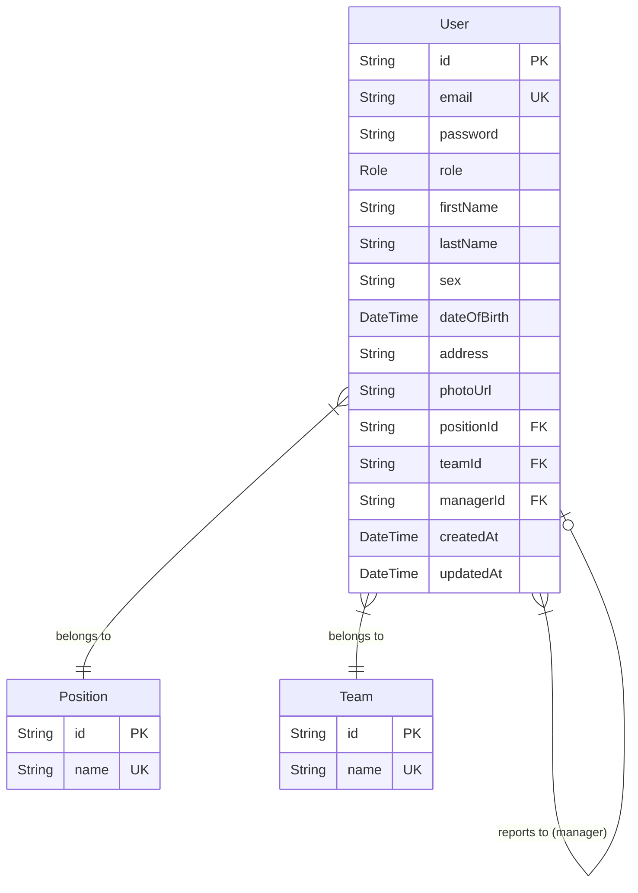

# Database Schema

This project uses PostgreSQL with Prisma ORM. Below is the entity-relationship diagram and a detailed description of the models.

## Entity-Relationship Diagram

## Models

### User (Unified Entity)
The `User` model handles both authentication and organizational data.
- **Roles:** `ADMIN`, `EDITOR`, `READER`.
- **Self-Relation:** `managerId` points to another `User` to define the reporting hierarchy.
- **Relations:** 
    - `positionId`: Links to the user's job title.
    - `teamId`: Links to the user's assigned team.

### Position
Dynamic job titles defined by the Administrator.
- **Fields:** `id`, `name` (e.g., "CEO", "Senior Developer").

### Team
Organizational groups defined by the Administrator.
- **Fields:** `id`, `name` (e.g., "Engineering", "Marketing").

## Enums

### Role
- `ADMIN`: Full system access.
- `EDITOR`: Manage organization entries (People/Users).
- `READER`: Read-only access to the directory and search.
